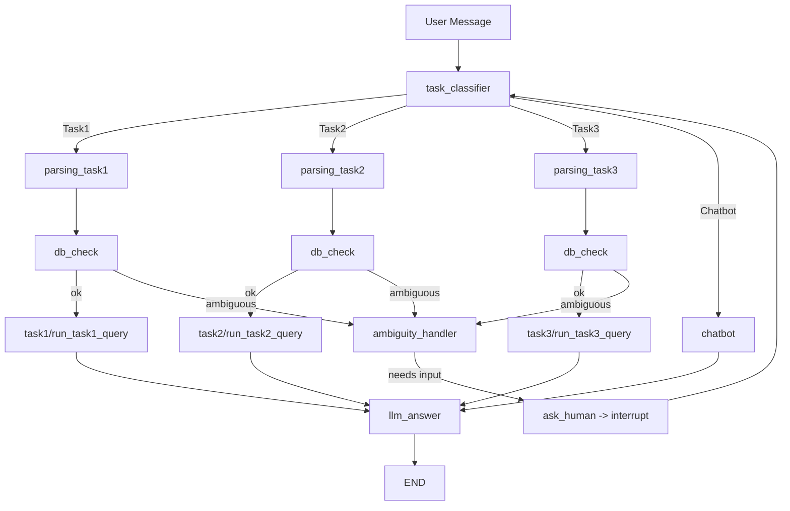

# Fin_agent란

fin_agent는 국내 주식시장 데이터를 이해하기 어려워하는 사용자를 위해
“질의 → 분석 → 응답”의 전체 과정을 자동화한 금융 분석 LLM 에이전트입니다.
한국 주식시장(코스피·코스닥) 데이터를 기반으로 사용자의 자연어 질의를 자동으로 분석하고,
주가·지표·신호·패턴을 SQL 기반으로 조회하여 자연어로 응답하는 금융 특화 LLM 에이전트입니다.
LangGraph로 상태 전이를 관리하며, LangSmith로 프롬프트·실행을 추적해
안정적인 금융 분석 워크플로우를 제공합니다.

예시 입력 및 출력:
	•	입력: “삼성전자 vs LG전자 최근 3개월 수익률 비교”, “RSI 70 돌파 종목 알려줘”
	•	분류: Task1(단순조회/랭킹) · Task2(조건검색) · Task3(신호/패턴) · Chatbot
	•	실행: Task별 SQL/로직 실행 → 자연어 요약 응답

	• 목적: 국내 종목 기반 ‘질의 → 분류 → SQL 분석 → 자연어 응답’의 전체 흐름을 자동화
⸻

# 문제 정의
국내 주식 데이터는 지표·기간·패턴이 모두 다르고 자연어 질문에는 모호성이 많아, 일반 사용자가 원하는 분석을 즉시 실행하기 어렵다는 문제가 있습니다.
질문을 분석 가능한 형태로 바꾸기 위해서는
	
	•	Task 분류
	
	•	조건 파싱
	
	•	SQL/지표 계산
	
	•	패턴 감지
	
	•	결과 해석

같은 절차가 필요하지만, 이를 수동으로 처리하기엔 진입 장벽이 높습니다.

FinAgent는 이러한 문제를 해결하기 위해
“자연어 질의 → Task 분류 → SQL 기반 데이터 분석 → 자연어 응답”
전체 흐름을 자동화한 금융 분석 에이전트입니다.

즉, 누구나 자연어로 질문만 하면
필요한 지표 계산·조건 검색·패턴 탐지를 자동으로 수행해
사용자 친화적인 금융 분석 결과를 즉시 제공하는 것이 FinAgent의 해결 목표입니다.

⸻

## Features
• 자연어 → Task 분류  
   LangSmith에 저장된 task_classifier 프롬프트 기반 라우팅

• 정밀 파싱  
   parsing_task1/2/3 + Pydantic 스키마 검증

• DB 질의/후처리  
   yfinance 기반 ETL → ENGINE 조회

• 모호성 처리  
   필수 필드 누락 시 Clarification 질문 자동 생성

• 유형별 응답 템플릿  
   _r_task1_*, _r_task2, _r_task3의 일관된 포맷

⸻

## 로컬 실행 준비

이 프로젝트는 Python 3.11, MySQL 8, OpenAI API, LangSmith Hub를 사용합니다.

### 1) 설치

```bash
git clone https://github.com/Jaeseong22/fin_agent.git
cd fin_agent

python3.11 -m venv .venv
source .venv/bin/activate
pip install -r requirements.txt
```

### 2) 환경 변수

환경 변수 파일을 생성하고 `OPENAI_API_KEY`를 입력합니다.

```bash
cp .env.sample .env
```

`OPENAI_API_KEY`는 질의 분류, 파싱, 자연어 응답에 사용하는 OpenAI 모델 호출에 필요합니다.
분류·파싱 프롬프트는 LangSmith Hub의 공개 프롬프트
`jaeseong22/task_classifier`, `jaeseong22/parsing_task1`,
`jaeseong22/parsing_task2`, `jaeseong22/parsing_task3`에서 직접 불러옵니다.
따라서 프롬프트 사용에는 `LANGSMITH_API_KEY`가 필요하지 않습니다.

### 3) MySQL 실행 및 데이터 적재

Docker Compose로 MySQL 8을 실행합니다.

```bash
docker compose up -d mysql
docker compose ps
```

MySQL이 준비되면 전체 유니버스의 최근 6개월 데이터를 적재합니다.

```bash
python scripts/load_stock_prices.py \
  --universe-csv data/universe.csv \
  --truncate
```

DB 연결과 데이터 상태를 확인합니다.

```bash
python scripts/check_tasks.py
```

### 4) 실행

```bash
python graph/sim.py
```

### 5) 테이블 스키마

현재 코드가 실제로 읽는 핵심 테이블은 `stock_prices`입니다.
`official_name`은 관리 편의를 위한 보조 컬럼이고, 현재 쿼리 로직의 필수 컬럼은 아닙니다.

```sql
CREATE TABLE stock_prices (
	id BIGINT AUTO_INCREMENT PRIMARY KEY,

	name VARCHAR(100) NOT NULL,          -- 예: 005930_삼성전자
	official_name VARCHAR(100) NOT NULL, -- 예: 삼성전자
	trade_date DATE NOT NULL,

	open DOUBLE,
	high DOUBLE,
	low DOUBLE,
	close DOUBLE,
	adj_close DOUBLE,
	volume BIGINT UNSIGNED,

	market_cap BIGINT,                  -- 시가총액 = 종가 * 상장주식수

	UNIQUE KEY uq_stock_date (name, trade_date),
	INDEX idx_trade_date (trade_date),
	INDEX idx_name (name),
	INDEX idx_official_name (official_name),
	INDEX idx_market_cap (market_cap)
);
```

컬럼 의미는 아래처럼 잡으면 됩니다.

```text
name          : 종목코드_종목명 형태. 예) 005930_삼성전자
official_name : 종목명만 따로 저장. 예) 삼성전자
trade_date    : 거래일
open          : 시가
high          : 고가
low           : 저가
close         : 종가
adj_close     : 수정종가
volume        : 거래량
market_cap    : 시가총액 = 종가 * 상장주식수
```

### 6) 전체 유니버스 적재

적재는 보통 아래 순서로 하면 됩니다.

1. yfinance에서 최근 6개월치 OHLCV를 수집한다.
2. 종목코드와 종목명을 합쳐 `name`을 만든다. 예: `005930_삼성전자`
3. `official_name`에는 종목명만 저장한다.
4. `trade_date`, `open`, `high`, `low`, `close`, `adj_close`, `volume`을 그대로 넣는다.
5. 시가총액은 별도 스테이징 테이블에서 계산한 뒤 `stock_prices.market_cap`에 업데이트한다.

로컬에서 전체 유니버스를 적재하려면 다음을 권장합니다.

1) 먼저 테스트로 일부만 적재 (`--limit`)하여 DB 연결/권한/데이터 형식을 확인합니다.

```bash
python scripts/load_stock_prices.py --universe-csv data/universe.csv --limit 20
```

2) 이상 없으면 전체 적재를 수행합니다 (원하시면 `--truncate`로 덮어쓰기).

```bash
python scripts/load_stock_prices.py --universe-csv data/universe.csv
```

3) CI/스케줄링으로 자동 실행하려면 아래의 GitHub Actions 예시를 사용하세요 (비밀은 `Secrets`에 저장).

`data/universe.csv`는 아래처럼 준비합니다.

```csv
종목코드,종목명,시장구분
005930,삼성전자,KOSPI
000660,SK하이닉스,KOSPI
```

스크립트는 `stock_prices`와 `market_cap_stage`를 자동 생성하고, 최근 6개월치 데이터를 yfinance에서 받아 적재합니다.

시가총액 스테이징은 이렇게 두면 됩니다.

```sql
CREATE TABLE market_cap_stage (
	name VARCHAR(100) NOT NULL,
	trade_date DATE NOT NULL,
	market_cap BIGINT,
	UNIQUE KEY uq_stage (name, trade_date),
	INDEX idx_stage_name_date (name, trade_date)
);
```

스테이징 값으로 본 테이블을 갱신합니다.

```sql
UPDATE stock_prices s
JOIN market_cap_stage m
  ON s.name = m.name
 AND s.trade_date = m.trade_date
SET s.market_cap = m.market_cap;
```

### 7) 주의사항

Task2에서 등락률/거래량 변화율을 계산할 때 `volume`이 `BIGINT UNSIGNED`이면 MySQL 연산 특성상 캐스팅을 명시하는 편이 안전합니다.

```sql
((CAST(t.volume AS SIGNED) - CAST(p.volume AS SIGNED))
 / NULLIF(CAST(p.volume AS SIGNED), 0) * 100.0)
```

현재 코드도 동일한 방식으로 처리하고 있습니다.

### 8) 적재 후 확인

```sql
SELECT COUNT(*) FROM stock_prices;

SELECT COUNT(*)
FROM stock_prices
WHERE market_cap IS NOT NULL;

SELECT name, trade_date, close, volume, market_cap
FROM stock_prices
WHERE market_cap IS NOT NULL
ORDER BY trade_date DESC
LIMIT 10;
```

⸻

## Architecture



전체 그래프는 입력 → 분류 → 파싱 → DB 검증 → SQL 실행 → 응답의
안정적인 처리 파이프라인을 LangGraph로 구현한 구조입니다.

⸻

## Core Graph (노드 동작 요약)

1) 분류기 — task_classifier(state) -> Command[goto]
	•	입력: state["messages"][-1]
	•	동작:
	•	LangSmith의 task_classifier 프롬프트를 pull → .invoke
	•	첫 번째 tool_call의 arguments JSON 파싱 → "Task" 추출
	•	Task1|Task2|Task3|Chatbot|Task4(ask_human) 분기
	•	해당 Task Pydantic 인스턴스 초기화 후 goto
	•	실패 시: chatbot 폴백

2) 챗봇 — chatbot(state) -> llm_answer
	•	ChatOpenAI(model="gpt-4o-mini", temperature=0.2)로 일반 대화 응답
	•	분류 실패/스몰토크 등 폴백 경로

3) 파싱 — query_parsing(state) -> db_check | ask_human
	•	parsing_task{1|2|3} 프롬프트 호출 → 결과를 parse_tool_json
	•	Pydantic 모델(Task1|2|3)에 model_copy(update=payload)로 검증
	•	실패 시: ask_human

4) 준비 점검 — db_check(state) -> task{1|2|3} | ambiguity_handler
	•	필수 필드 체크:
	•	Task1: date
	•	Task2: date & clauses
	•	Task3: period_start|period_end & 신호 단서(term_hits)
	•	미달 시: ambiguity_handler

5) 실행 — task1|task2|task3(state) -> llm_answer
	•	run_task{1|2|3}_query(task_obj, ENGINE) 호출
	•	결과는 state에 taskX_result로 저장

6) 사용자 확인 — ask_human(state) -> task_classifier
	•	AIMessage(content=q)로 부족 항목 질문
	•	interrupt(...)로 그래프 일시정지 → 사용자 입력 대기
	•	재개 시: rewrite_query_with_human_feedback로 원문+추가정보 병합 → 재분류

7) 모호성 처리 — ambiguity_handler(state) -> task{1|2|3} | ask_human
	•	apply_ambiguity_resolution(query_text)로 정규화/용어 히트 추출
	•	최소 요건 충족 시 즉시 실행, 아니면 부족 항목만 묻는 질문 생성

8) 응답 합성 — llm_answer(state) -> END
	•	_pick_best_result(state)로 최신 결과 선택
	•	Task1 유형:
metric_rank, market_comparison, stock_comparison,
simple_lookup, stock_rank, stock_to_market_ratio, market_index_comparison
	•	Task2: _r_task2(result)
	•	Task3: _r_task3(result)
	•	normalized_query가 있으면 헤더에 질의 원문을 표시해 Trace 가독성 확보
⸻

## Ambiguity & Error Handling
	•	Ambiguity: 필수정보 누락 → ambiguity_handler가 부족 항목만 묻는 맞춤 질문 생성
	•	Validation: 파싱 실패/Pydantic 오류 → ask_human로 전환
	•	DB 오류: run_task*_query 예외는 {status:"error", reason}로 래핑 → llm_answer가 사용자 친화 메시지 생성
	•	Fallback: 분류 실패 → chatbot

## 실행 화면
https://github.com/user-attachments/assets/4af263c7-2bdf-45ff-b8a3-e4ade84e98c4
